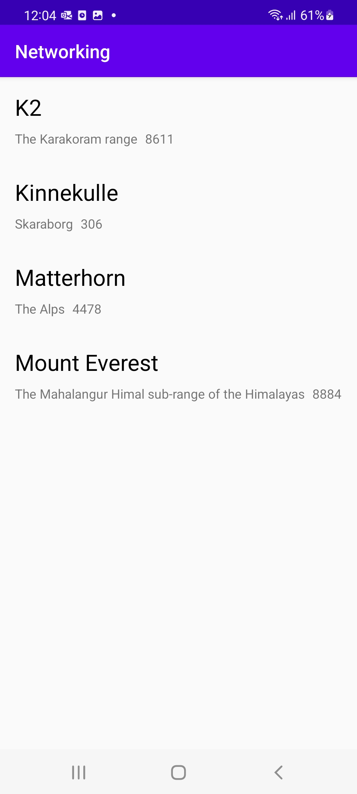

# Rapport

## Recycler View

Recycler View används för att kunna iterera igenom och visa viss data. 

```
// activity_main.xml
<androidx.recyclerview.widget.RecyclerView
        android:id="@+id/recyclerView"
        android:layout_width="match_parent"
        android:layout_height="match_parent"
        app:layout_constraintStart_toStartOf="parent"
        app:layout_constraintTop_toTopOf="parent" />
```

## Mountain Item

Desingen för varje "list-item" eller "mountain-item" bestäms hos \layout\mountain_item.xml.

## Mountain & Auxdata

JSON-datan som hämtas innehåller objekten "mountain". En del objekt innehåller "auxdata" som i sin
tur innehåller objekt. Detta representeras genom att skapa två java klasser, Mountain och Auxdata,
vars syfte är att fungera som modeller. Auxdatan deklareras hos Mountain. 

```
// Mountain
public class Mountain {
    @SerializedName("ID")
    private String id;
    private String name, type, company, location, category;
    private Integer cost, size;
    private Auxdata auxdata;
```
```
// Auxdata
public class Auxdata {
    private String wiki;
    private Uri imageUri;
```

## Recycler Adapter

För att visa och iterera all data med Recycler View skapas det en adapter till den. Detta görs med 
följd av att kunna placera all data (för varje berg) och sättas in till varje lista "Mountain Item".

```
// Inom RecyclerAdapter klassen

private ArrayList<Mountain> mountains;

// (...)

@Override
public void onBindViewHolder(@NonNull RecyclerAdapter.MountainViewHolder holder, int position) {
    String name = mountains.get(position).getName();
    String location = mountains.get(position).getLocation();
    Integer size = mountains.get(position).getSize();
    holder.name.setText(name);
    holder.location.setText((location));
    holder.size.setText(size.toString());
}

public class MountainViewHolder extends RecyclerView.ViewHolder {

    private TextView name, location, size;

    public MountainViewHolder(final View itemView) {
        super(itemView);
        name = itemView.findViewById(R.id.mountainName);
        location = itemView.findViewById(R.id.mountainLocation);
        size = itemView.findViewById(R.id.mountainSize);
    }

}
```
## Insättning av JSON data

Eftersom processen för hämtningen av JSON datan redan hanteras, användes metoden 'onPostExecute' då
datan är redo (Async). 

Först skickas URL'n för JSON.

```
// MainActivity

// (...)

// OnCreate() 
new JsonTask(this).execute(JSON_URL);
```

När vi väl har datan, körs 'onPostExecute' som har med sig json-datan som parameter. Med hjälp av
Gson kan vi enkelt konvertera JSON till Java-klasser. Denna data konverteras till Mountain-objekt,
som skapades tidigare. All Auxdata skapas samtidigt, men sätts in hos Mountain-objekt som medlem.

Alla berg sparas som en ArrayList med typen Mountain som 'mountains'. Denna ArrayList skickas till
RecyclerAdaptern som sedan itererar igenom 'mountains'. 

```
// MainActvity
@Override
public void onPostExecute(String json) {
    Gson gson = new Gson();
    Type type = new TypeToken<ArrayList<Mountain>>(){}.getType();
    mountains = gson.fromJson(json, type);
    
    RecyclerAdapter recyclerAdapter = new RecyclerAdapter(mountains);
    
    RecyclerView.LayoutManager layoutManager = new LinearLayoutManager(getApplicationContext());
    recyclerView = findViewById(R.id.recyclerView);
    recyclerView.setLayoutManager(layoutManager);
    recyclerView.setItemAnimator(new DefaultItemAnimator());
    recyclerView.setAdapter(recyclerAdapter);
}
```




